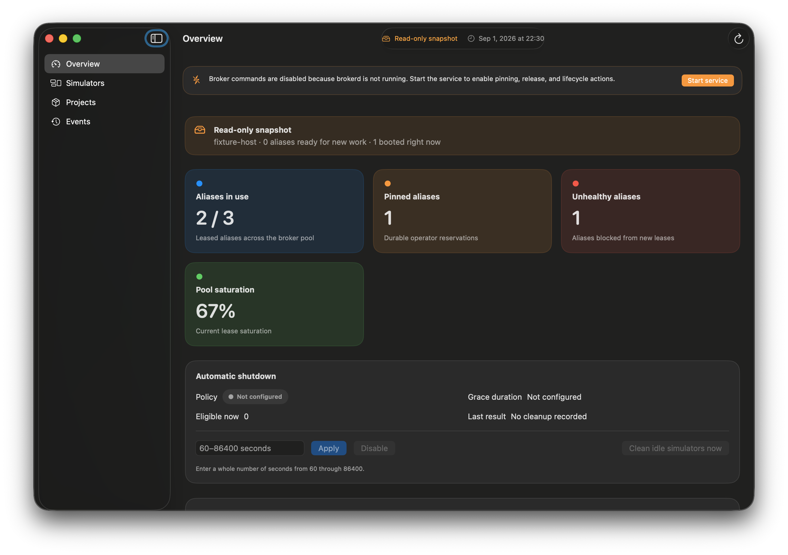

# Simulator Broker

A local control plane so humans, AI agents, and CI jobs can share iOS Simulators
on one Mac without stealing devices from each other.

> **Alpha.** macOS only. Xcode is required to create or run iOS Simulators.
> Interfaces can change. Install the CLI with Homebrew or the `simbroker`
> npm package. Install the operator app with the Homebrew cask.

[](https://github.com/fiveonecode/simulator-broker/actions/workflows/ci.yml)

Simulator Broker leases simulator aliases by *purpose* (for example
`agent-ui-session` or `manual-testing`) instead of hard-coding UDIDs. A local
`brokerd` service is the single authority. The macOS app shows what is leased,
pinned, booted, or unhealthy.



## Who this is for

- iOS and macOS engineers who run more than one simulator workflow on a machine
- people using AI coding agents that boot, reset, or test on the Simulator
- CI or unattended jobs that need a resettable device without colliding with a
  human checkout

If you only ever use one simulator by hand, you may not need this yet.

## Use it

Install the CLI with Homebrew. Install the operator app with its Homebrew cask
if you want the dashboard, then run one guided machine setup. Homebrew does not create
Simulator devices. `simbroker setup` first shows every prerequisite, the selected
runtime, and the exact six-device plan; nothing changes until you confirm it.
Node.js 20+ is still required at runtime.

```bash
brew install fiveonecode/simulator-broker/simbroker
simbroker --help
```

Homebrew clones
[`fiveonecode/homebrew-simulator-broker`](https://github.com/fiveonecode/homebrew-simulator-broker)
for that tap name. `Formula/` and `Casks/` in this repository stay the
source of truth.

```bash
brew install --cask fiveonecode/simulator-broker/simulator-broker
```

That cask downloads `Simulator-Broker-<version>.zip` from
[GitHub Releases](https://github.com/fiveonecode/simulator-broker/releases).
It is the recommended app install and does not require XcodeGen.

Open the app and click **Complete first-time setup**, or use the same guided CLI
flow:

```bash
open -a "Simulator Broker"
simbroker setup
```

The preview automatically selects the newest installed iOS runtime compatible
with both iPhone and iPad, lists all six aliases as **Create** or **Reuse**, and
asks once before provisioning. It then writes host configuration atomically,
starts `brokerd`, refreshes the app snapshot, and verifies health. Rerun
`simbroker setup` after an interruption; it safely finishes later stages without
duplicating devices. For automation, use `simbroker setup --json`, then apply
the returned `planId` with `--apply --confirm <plan-id> --json`.

After a lease is released, its Simulator may stay booted for fast reuse. That
is intentional: Automatic shutdown is off until a human enables it. Inspect or
opt in with:

```bash
simbroker idle status
simbroker idle enable --grace-seconds <60-86400> --actor-type human --actor-id <operator-id>
```

Other CLI install options:

```bash
npm install -g https://github.com/fiveonecode/simulator-broker/releases/download/v0.1.0-alpha.7/simbroker-0.1.0-alpha.7.tgz
simbroker --help
```

From a clone:

```bash
bash scripts/install_local.sh --cli-only
command -v simbroker
simbroker --help
```

The clone installer copies the CLI runtime only. It does not run XcodeGen or
build the macOS app. If Homebrew is installed, `simbroker` lands in
`$(brew --prefix)/bin`. Otherwise the installer writes `~/.local/bin/simbroker`
and one guarded login-shell PATH line. Open a new terminal if this shell still
cannot resolve `simbroker`. `source .../env.sh` remains a fallback.

Xcode is still required to create and run iOS Simulators. Alpha CLI tarballs
are also attached to those releases. The archive contains a versioned top-level
directory:

```bash
tar -xzf simulator-broker-0.1.0-alpha.7-cli.tar.gz
./simulator-broker-0.1.0-alpha.7-cli/bin/simbroker --help
```

`simbroker` help and `simbroker doctor` print human-readable text by default.
Pass `--json` for machine-readable payloads.

To build the operator app from this checkout, use the contributor command in
[Develop it](#develop-it).

## Develop it

Same Node.js requirement, plus Xcode and XcodeGen, then:

```bash
npm run install:local
npm test
npm run build:app
```

`install:local` builds the Debug app, installs the CLI, and copies
`Simulator Broker.app` to `~/Applications`. XcodeGen is required only for this
source-build path, not for the Homebrew cask.

Contributor setup is in [CONTRIBUTING.md](CONTRIBUTING.md). A small public
patch uses Node.js 20 and the Node test suites. Maintainers and agent runs
keep the `agent:context` / `agent:verify` / `agent:complete` track.

## Five-minute hello world

After `simbroker setup` reports ready:

```bash
mkdir -p /tmp/sample-broker-repo && cd /tmp/sample-broker-repo
simbroker project init
simbroker project validate
simbroker capacity check --purpose agent-ui-session --json
```

Read `purposes[].status` (and `summary` counts), not the top-level
`status`. Top-level `status` is only `ready` or `needs_attention`.

If `purposes[].status` is `unavailable`, stop. Preview missing capacity
with `simbroker capacity reconcile --json`. Do not acquire a lease.

If `purposes[].status` is `repair_needed`, stop. Run `simbroker doctor`,
then `simbroker simulators repair --alias <alias>` for the alias doctor
names. Do not acquire a lease.

If `purposes[].status` is `available`:

```bash
simbroker lease acquire --purpose agent-ui-session --lease-file /tmp/simbroker-hello-lease.json
simbroker host status
simbroker lease release --lease-file /tmp/simbroker-hello-lease.json
```

## Next reading

- [Getting started](docs/getting-started.md) — install, first-run, reinstall, and uninstall
- [Concepts](docs/concepts.md) — host, project, purpose, lease, pin, and `brokerd`
- [Current capabilities](docs/status.md) — what this Alpha already implements
- [Open an issue](https://github.com/fiveonecode/simulator-broker/issues/new/choose) — install failure, bug, or feature
- [Harness integration](spec/harness-integration.md) — make a consumer repo broker-aware
- [Sample consumer repo](examples/harness-adoption/sample-consumer-repo/README.md)

## Security

Please report security issues privately through GitHub Security Advisories when
available. See [SECURITY.md](SECURITY.md).

## License

Simulator Broker is available under the MIT License. See [LICENSE](LICENSE).

## Specs

Implementation contracts live under [`spec/`](spec/README.md). Start with
[spec/global-simulator-broker.md](spec/global-simulator-broker.md) and
[spec/architecture.md](spec/architecture.md).
